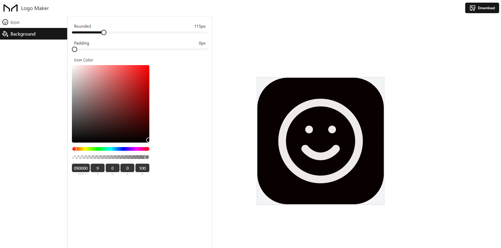

# Logo Creator

This project is a web application built with React that allows users to create logos using a collection of icons. It provides a user-friendly interface for selecting icons, customizing their appearance, and combining them into unique logo designs.



## Installation

Clone the repository:
```
git clone https://github.com/ixedasan/react-logo-maker.git
cd react-logo-maker
```
Install dependencies:
```
npm install
```
Start the development server:
```
npm run dev
```

## Contributing

Contributions are welcome! Please open an issue or submit a pull request for any improvements or bug fixes.